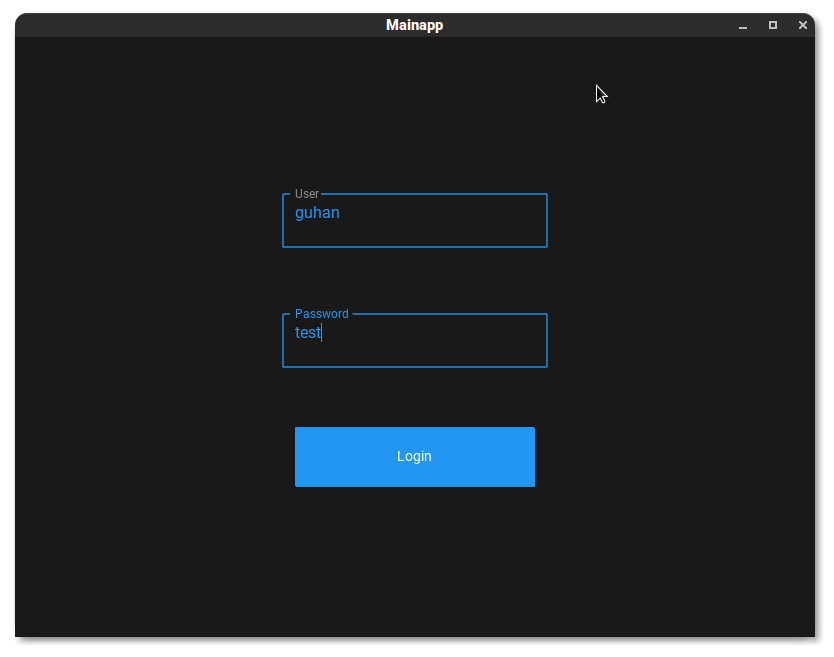
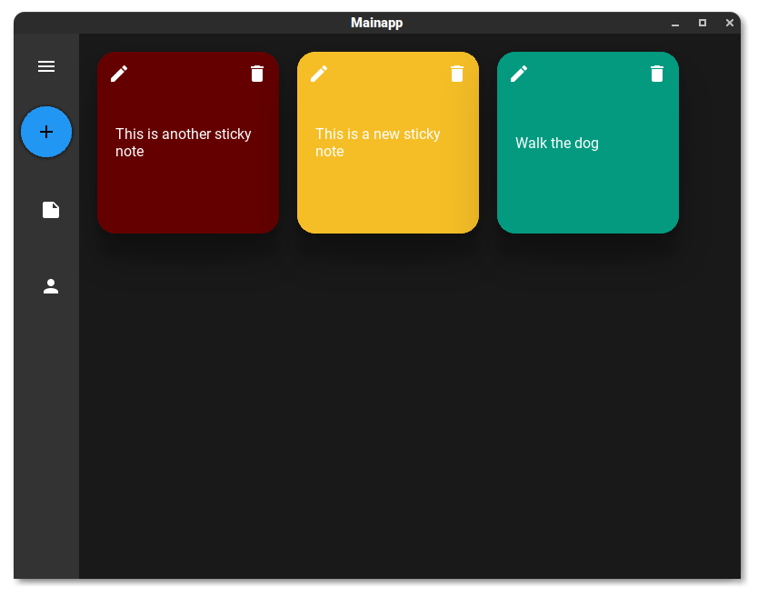
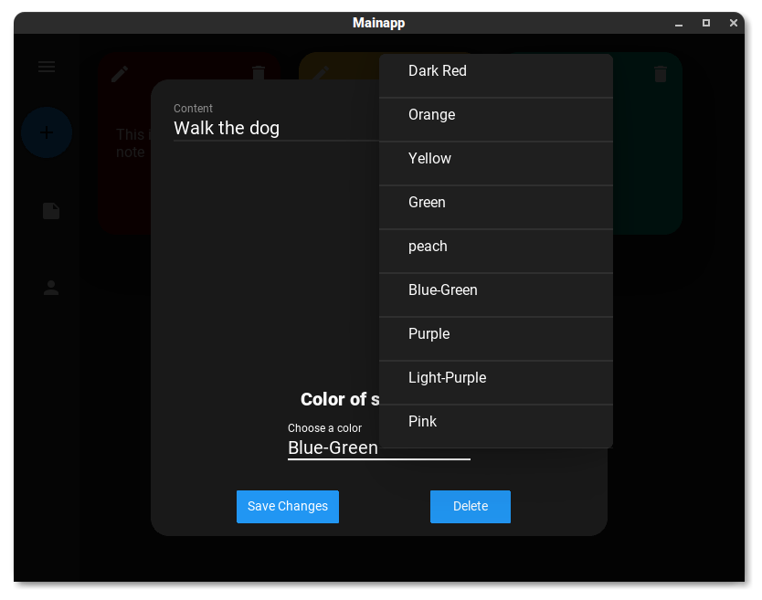
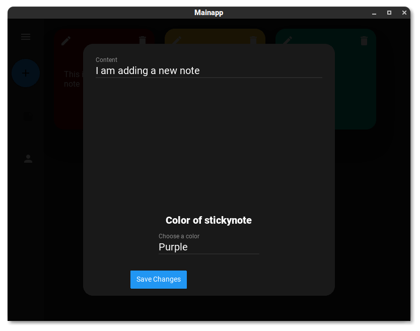
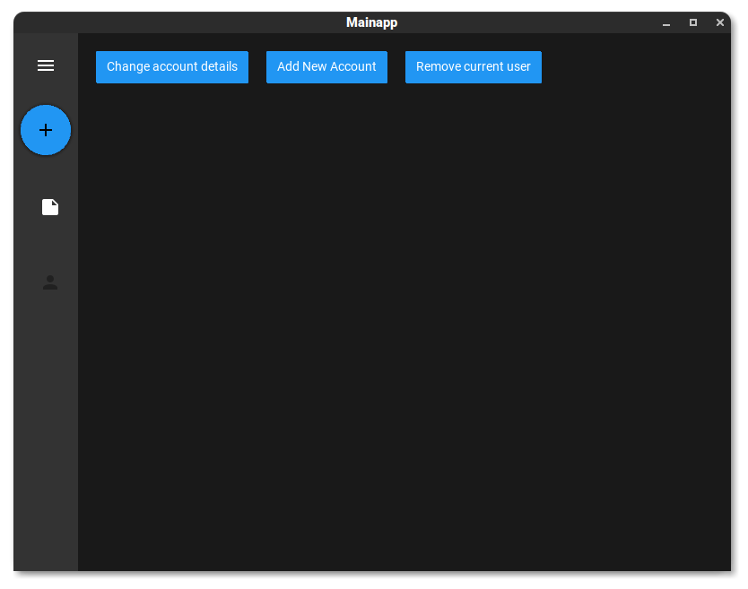
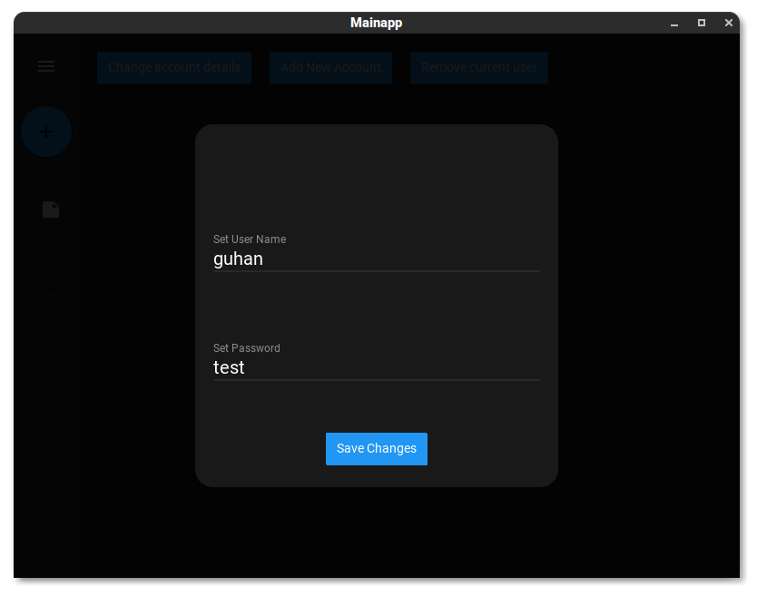
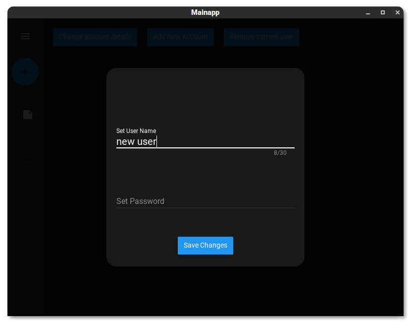

# StickyNote-Program
This is a very basic stickynote program that was created within python using the kivy and primarily the kivymd libraries. The program also uses Mysql for storing all user data and their respective sticky notes. This program was created as a very simple example to what are the capabalities of the kivy and kivymd library and to demonstrate how simple it is to create a somewhat good looking user interface.

# Note
This program was intended to show how easy it is ot create a gui with kivy and kivymd so numerous shortcuts where taken and there are various loopholes in the logic in the program. This was done to keep the complexity of the program down. But major features are somewat foolproof.

Please also note that I have very slighly modified the kivymd card widget so that I could make it colored and also give it a name property. I have added the kivymd library with the changes in the repo.

# Overview
The program works on the idea that there are multiple users with their own user name and login password. Each user is able to maintain his/her stickynotes separate from the rest and muct login to view and update these notes. A user once logged in can view,update and delete any notes. The notes are ordered on GUi based on the date they where created.(The latest created note being the last)

# Features
+ Ability to create multiple users with their own user id and password
+ Create stickynotes that contain some information and can be colored off of a pallette of 9 colors
+ You can edit the sticky note after creation including changing the color
+ Stickynotes can also be created
+ The current user's credentials can be changed(user name and password)
+ The current user can also be deleted along with all stickynotes associated with that user
+ A new user login can also be created

# Database Structure
The program uses Mysql to store all the date of the program and its users. There are two types of tables stored in the database...
+**User table**: This table is called users and contains the user ids and passwords for all the users. Both the username and the password is limited to the 30 characters.
+**Sticky Note Table**: Each user will get their own table in their user id name. This table stores all the stickynotes that he or she creates. It has a structure of: id(the id is a random number that basically acts like a primary key), content(contains the actual content of the stickynote), date (contains the data the note was created), color (holds an int from 0-9 that reference the notes color)

The database files are also provided inside a folder called stickynote

# Images
Here are some screenshots of the program running...

+ **Login Page**  
+ **MainScreen**  
+ **Modifying an Existing Note**  
+ **Adding A New Note**  
+ **User Menu**  
+ **Updating A User's Credentials**  
+ **Adding A New User**  
